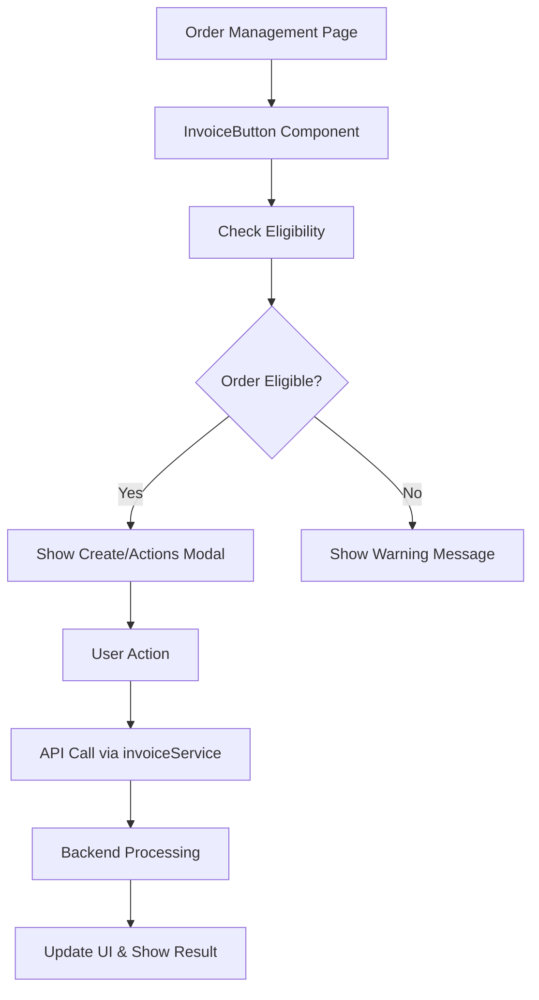

# E-Invoice Integration Guide

## 📋 Overview

This document describes the integration of the e-invoice backend functionality with the NextJS frontend. The integration provides a seamless user experience for creating, managing, and downloading electronic invoices directly from the order management page.

## 🏗️ Architecture

### Frontend Components

```
src/
├── services/
│   └── invoiceService.ts          # API service layer
├── components/
│   └── InvoiceButton.tsx          # Reusable invoice button component
├── types/
│   └── invoice.ts                 # TypeScript interfaces and types
├── app/account/orders/
│   └── page.tsx                   # Updated orders page with invoice integration
└── docs/
    └── INVOICE_INTEGRATION_GUIDE.md # This documentation
```

### Integration Flow



## 🔧 Components

### 1. InvoiceService (`src/services/invoiceService.ts`)

**Purpose**: Handles all API communications with the Spring Boot backend.

**Key Features**:
- JWT token authentication
- Error handling with automatic login redirect
- File download management
- Type-safe API calls

**Main Methods**:
```typescript
// Check if order can have invoice
checkEligibility(orderId: number): Promise<InvoiceEligibilityResponse>

// Create new invoice
createInvoice(request: CreateInvoiceRequest): Promise<InvoiceResponse>

// Get existing invoice by order ID
getInvoiceByOrderId(orderId: number): Promise<InvoiceResponse | null>

// Download PDF with proper filename
downloadInvoicePdf(invoiceId: number, invoiceNumber?: string): Promise<void>

// Send invoice via email
sendInvoiceByEmail(invoiceId: number, emailAddress: string): Promise<string>
```

### 2. InvoiceButton Component (`src/components/InvoiceButton.tsx`)

**Purpose**: Reusable UI component that handles the complete invoice workflow.

**Key Features**:
- Smart eligibility checking
- Conditional rendering based on order status
- Modal-based user interactions
- Loading states and error handling
- File download management

**Props**:
```typescript
interface InvoiceButtonProps {
    orderId: number
    orderStatus?: string
    onInvoiceCreated?: (invoice: InvoiceResponse) => void
    size?: 'small' | 'middle' | 'large'
    type?: 'default' | 'primary' | 'text'
    disabled?: boolean
}
```

**Usage Example**:
```tsx
<InvoiceButton
    orderId={123}
    orderStatus="DELIVERED"
    onInvoiceCreated={(invoice) => console.log('Invoice created:', invoice)}
    type="text"
/>
```

### 3. Type Definitions (`src/types/invoice.ts`)

**Purpose**: Centralized TypeScript interfaces matching backend DTOs.

**Key Types**:
- `InvoiceResponse`: Complete invoice data structure
- `CreateInvoiceRequest`: Request payload for invoice creation
- `InvoiceStatus`: Union type for invoice statuses
- `INVOICE_STATUS_COLORS`: UI color mapping

## 🎯 User Experience Flow

### 1. Order List View
- Invoice buttons appear only for eligible orders (DELIVERED/COMPLETED status)
- Button shows loading spinner while checking eligibility
- Button is hidden for orders that cannot have invoices

### 2. Invoice Creation Flow
```
1. User clicks invoice button
2. System checks eligibility automatically
3. If eligible and no existing invoice:
   → Show "Create Invoice" modal
4. If eligible and invoice exists:
   → Show "Invoice Actions" modal with download/email options
5. If not eligible:
   → Show warning message
```

### 3. Create Invoice Modal
- **Order ID**: Auto-filled and disabled
- **Customer Email**: Optional, validated email format
- **Customer Name**: Optional, max 255 characters
- **Notes**: Optional, max 1000 characters
- **Validation**: Real-time form validation
- **Submit**: Creates invoice and auto-generates PDF

### 4. Invoice Actions Modal
- **Invoice Info**: Number, status, amount, date
- **Download PDF**: Direct download with proper filename
- **Send Email**: Opens email modal for recipient input
- **Status Display**: Color-coded status tags

### 5. Email Sending
- **Email Validation**: Required field with format validation
- **Pre-fill**: Uses customer email if available
- **Success Feedback**: Confirmation message on successful send

## 🔒 Security & Authorization

### Frontend Security
- **JWT Token**: Automatically included in all API requests
- **Auto Logout**: Redirects to login on 401 responses
- **Input Sanitization**: Form validation and data cleaning
- **Error Handling**: Graceful error messages without exposing internals

### Backend Authorization (from Spring Boot)
- **ADMIN**: Full access to all invoice operations
- **DISPATCHER**: Can create, view, send invoices
- **OPERATIONS**: Can create, view, send invoices  
- **CUSTOMER**: Can view and download invoices only

## 🧪 Testing Guide

### Manual Testing Checklist

#### Prerequisites
1. ✅ Spring Boot backend running on `http://localhost:8080`
2. ✅ NextJS frontend running on `http://localhost:3000`
3. ✅ Valid JWT token in localStorage
4. ✅ Test orders with DELIVERED/COMPLETED status

#### Test Scenarios

**1. Invoice Button Visibility**
```bash
# Test Case: Button should only appear for eligible orders
1. Navigate to /account/orders
2. Verify invoice buttons appear only for DELIVERED/COMPLETED orders
3. Verify buttons are hidden for PENDING/PROCESSING orders
```

**2. Invoice Creation Flow**
```bash
# Test Case: Create new invoice successfully
1. Click invoice button on eligible order without existing invoice
2. Fill in customer email and name (optional)
3. Add notes (optional)
4. Click "Tạo hóa đơn"
5. Verify success message appears
6. Verify invoice actions modal opens automatically
```

**3. PDF Download**
```bash
# Test Case: Download invoice PDF
1. Click invoice button on order with existing invoice
2. Click "Tải PDF" in actions modal
3. Verify PDF file downloads with correct filename format
4. Verify PDF opens correctly and contains invoice data
```

**4. Email Sending**
```bash
# Test Case: Send invoice via email
1. Click "Gửi Email" in invoice actions modal
2. Enter valid email address
3. Click "Gửi email"
4. Verify success message appears
5. Check email recipient receives invoice PDF
```

**5. Error Handling**
```bash
# Test Case: Handle various error scenarios
1. Try creating invoice for ineligible order → Warning message
2. Submit create form with invalid email → Validation error
3. Try sending email with invalid address → Error message
4. Test with expired JWT token → Redirect to login
```

### Automated Testing

**Unit Tests** (to be implemented):
```typescript
// Example test structure
describe('InvoiceService', () => {
    test('should check eligibility correctly', async () => {
        // Mock API response
        // Call checkEligibility
        // Assert response
    })
    
    test('should handle 404 for non-existent invoices', async () => {
        // Test getInvoiceByOrderId with non-existent order
    })
})

describe('InvoiceButton', () => {
    test('should render button for eligible orders', () => {
        // Render component with DELIVERED order
        // Assert button is visible
    })
    
    test('should hide button for ineligible orders', () => {
        // Render component with PENDING order
        // Assert button is hidden
    })
})
```

## 🐛 Troubleshooting

### Common Issues

#### 1. "Network Error" or API calls failing
**Symptoms**: API calls return network errors or timeouts
**Solutions**:
- Verify Spring Boot backend is running on port 8080
- Check CORS configuration in backend
- Verify JWT token is valid and not expired
- Check browser network tab for specific error details

#### 2. "Unauthorized" errors (401)
**Symptoms**: API calls return 401, user gets redirected to login
**Solutions**:
- Check if JWT token exists in localStorage
- Verify token hasn't expired
- Ensure user has proper role permissions
- Re-login to get fresh token

#### 3. Invoice button not appearing
**Symptoms**: Invoice buttons don't show on orders page
**Solutions**:
- Verify order status is DELIVERED or COMPLETED
- Check console for JavaScript errors
- Verify InvoiceButton component is properly imported
- Check if orderId is being passed correctly

#### 4. PDF download not working
**Symptoms**: PDF download fails or file is corrupted
**Solutions**:
- Verify backend PDF generation is working
- Check if invoice has pdfFilePath set
- Ensure proper Content-Type headers
- Test PDF endpoint directly in browser

#### 5. Form validation errors
**Symptoms**: Form submission fails with validation errors
**Solutions**:
- Check email format validation
- Verify field length limits (name: 255, notes: 1000)
- Ensure required fields are filled
- Check for special characters in input

### Debug Commands

```bash
# Check backend API directly
curl -H "Authorization: Bearer YOUR_JWT_TOKEN" \
     http://localhost:8080/api/invoices/check-eligibility/1

# Check if invoice exists for order
curl -H "Authorization: Bearer YOUR_JWT_TOKEN" \
     http://localhost:8080/api/invoices/by-order/1

# Test PDF download
curl -H "Authorization: Bearer YOUR_JWT_TOKEN" \
     http://localhost:8080/api/invoices/1/download-pdf \
     --output test_invoice.pdf
```

### Browser Console Debugging

```javascript
// Check if token exists
console.log('Token:', localStorage.getItem('token'))

// Check if user data exists
console.log('User:', JSON.parse(localStorage.getItem('user') || '{}'))

// Test API call manually
fetch('http://localhost:8080/api/invoices/check-eligibility/1', {
    headers: {
        'Authorization': `Bearer ${localStorage.getItem('token')}`
    }
}).then(r => r.json()).then(console.log)
```

## 📈 Performance Considerations

### Optimization Strategies

1. **Lazy Loading**: Invoice button only checks eligibility when clicked
2. **Caching**: Consider caching invoice data for frequently accessed orders
3. **Debouncing**: Form validation is debounced to reduce API calls
4. **Error Boundaries**: Prevent invoice errors from crashing entire page
5. **File Handling**: PDF downloads use blob URLs for memory efficiency

### Monitoring

- **API Response Times**: Monitor invoice API performance
- **Error Rates**: Track failed invoice operations
- **User Actions**: Log successful invoice creations and downloads
- **File Sizes**: Monitor PDF generation performance

## 🚀 Future Enhancements

### Planned Features

1. **Bulk Invoice Generation**
   - Select multiple orders
   - Generate invoices in batch
   - Progress indicator for bulk operations

2. **Invoice Templates**
   - Multiple PDF templates
   - Custom branding options
   - Template preview

3. **Advanced Filters**
   - Filter orders by invoice status
   - Search invoices by number or customer
   - Date range filtering

4. **Real-time Updates**
   - WebSocket notifications for invoice status changes
   - Auto-refresh when invoices are updated
   - Push notifications for email delivery

5. **Analytics Dashboard**
   - Invoice generation statistics
   - Revenue tracking
   - Customer invoice history

## 📞 Support

### Development Team Contacts
- **Frontend Lead**: NextJS, React, TypeScript integration
- **Backend Lead**: Spring Boot API, invoice business logic
- **QA Team**: Testing procedures and validation

### Documentation Links
- [Backend Invoice API Documentation](../../../spring-project/document/ELECTRONIC_INVOICE_SYSTEM_GUIDE.md)
- [Frontend Component Documentation](./components/README.md)
- [Type Definitions](../types/invoice.ts)

---

**© 2025 KTC Logistics - E-Invoice Frontend Integration v1.0**

*Last Updated: September 19, 2025*
